# MEATTRACK Project Flowchart

```mermaid
flowchart TD
    Start([User Visits MEATTRACK])
    
    Start --> CheckAuth{Authenticated?}
    
    %% Public Path
    CheckAuth -->|No| PublicPath[Public Portal]
    PublicPath --> Browse[Browse Landing/Products]
    Browse --> Inquiry{Submit<br/>Inquiry?}
    Inquiry -->|Yes| SubmitInq[Submit Reseller Inquiry]
    SubmitInq --> InqMsg[Chatbot Guidance<br/>+ Team Leader Assignment]
    InqMsg --> InqWait[Inquiry Under Review]
    Inquiry -->|No| Browse
    
    %% Login Path
    CheckAuth -->|Yes| RoleCheck{User<br/>Role?}
    
    %% RESELLER WORKFLOW
    RoleCheck -->|Reseller| ResellerDash[Reseller Dashboard]
    ResellerDash --> ResellerNav{Navigate To?}
    
    ResellerNav -->|Place Order| PlaceOrder[Select Product & Quantity]
    PlaceOrder --> SubmitOrder[Submit Order]
    SubmitOrder --> OrderPending[Order Status: Pending]
    OrderPending --> TeamReview{Team Leader<br/>Decision?}
    TeamReview -->|Approve| OrderApproved[Order: Approved]
    TeamReview -->|Reject| OrderRejected[Order: Rejected]
    TeamReview -->|Fulfill| OrderFulfilled[Order: Fulfilled<br/>Inventory Deducted]
    
    ResellerNav -->|View History| OrderHistory[View All Orders<br/>+ Status & Notes]
    
    ResellerNav -->|Sales Reports| SubmitReport[Submit Period Report<br/>Total Sales & Orders]
    
    ResellerNav -->|Messages| SendMsg[Send Support Message<br/>Chatbot Reply]
    
    PlaceOrder --> ResellerNav
    OrderHistory --> ResellerNav
    SubmitReport --> ResellerNav
    SendMsg --> ResellerNav
    
    %% TEAM LEADER WORKFLOW
    RoleCheck -->|Team Leader| TLDash[Team Leader Dashboard]
    TLDash --> TLNav{Navigate To?}
    
    TLNav -->|Walk-in Sales| RecordSale[Record Counter Sale<br/>Product & Quantity]
    RecordSale --> SaleComplete[Sale Recorded<br/>Inventory Deducted]
    
    TLNav -->|Inquiries| ReviewInq[Review Pending<br/>Reseller Inquiries]
    ReviewInq --> InqDecision{Approve or<br/>Reject?}
    InqDecision -->|Approve| CreateReseller[Create Reseller Account<br/>Portal Access Granted]
    InqDecision -->|Reject| RejectInq[Inquiry Rejected]
    
    TLNav -->|Reseller Orders| ReviewOrder[Review Pending<br/>Reseller Orders]
    ReviewOrder --> OrderAction{Approve/<br/>Reject/<br/>Fulfill?}
    OrderAction -->|Approve| OrdApprove["Order: Approved"]
    OrderAction -->|Reject| OrdReject["Order: Rejected"]
    OrderAction -->|Fulfill| OrdFulfill["Order: Fulfilled<br/>(Inventory Deducted)"]
    
    TLNav -->|Inventory| ManageInv[Register Product Batches<br/>Set Expiry Dates]
    ManageInv --> BatchAlert{Expiry<br/>Soon?}
    BatchAlert -->|Yes| AlertTrigger[Alert System:<br/>Near-Expiry Warning]
    BatchAlert -->|No| InvComplete[Batch Registered]
    
    TLNav -->|Employees| ManageEmp[Manage Attendance<br/>Tasks & Merit Evaluations]
    
    TLNav -->|Reports| SubmitTLReport[Submit Team Sales Report]
    
    RecordSale --> TLNav
    ReviewInq --> TLNav
    ReviewOrder --> TLNav
    ManageInv --> TLNav
    ManageEmp --> TLNav
    SubmitTLReport --> TLNav
    
    %% OWNER WORKFLOW
    RoleCheck -->|Owner| OwnerDash[Owner Dashboard]
    OwnerDash --> OwnerNav{Navigate To?}
    
    OwnerNav -->|Products| ManageProd[Adjust Product Prices<br/>Set Reorder Levels]
    ManageProd --> PriceAdj[Create Price Adjustments<br/>Near-Expiry Sales]
    
    OwnerNav -->|Reports| ViewReports[View All Reports<br/>Reseller + Team Leader]
    
    OwnerNav -->|Forecasts| RunForecast[Run Demand Forecast<br/>Predict Product Qty]
    RunForecast --> ForecastResults[Display Predicted Quantities<br/>& Confidence Ranges]
    
    OwnerNav -->|Accounts| ManageAcc[Create/Manage Accounts<br/>Owner/TL/Reseller]
    
    OwnerNav -->|Audit Logs| ViewLogs[View Activity Logs<br/>All User Actions]
    
    ManageProd --> OwnerNav
    ViewReports --> OwnerNav
    RunForecast --> OwnerNav
    ManageAcc --> OwnerNav
    ViewLogs --> OwnerNav
    
    %% Exit Points
    ResellerNav -->|Logout| End1([Signed Out])
    TLNav -->|Logout| End2([Signed Out])
    OwnerNav -->|Logout| End3([Signed Out])
    InqWait -->|End| End4([Inquiry Complete])
    
    style Start fill:#90EE90
    style End1 fill:#FFB6C6
    style End2 fill:#FFB6C6
    style End3 fill:#FFB6C6
    style End4 fill:#FFB6C6
    style ResellerDash fill:#87CEEB
    style TLDash fill:#DDA0DD
    style OwnerDash fill:#F0E68C
    style OrderPending fill:#FFE4B5
    style OrderApproved fill:#98FB98
    style OrderFulfilled fill:#98FB98
    style OrderRejected fill:#FFB6C6
    style AlertTrigger fill:#FFD700
    style CreateReseller fill:#98FB98
```

## Key Workflows Documented

**Public/Inquiry Flow:**
- Browse products → Submit inquiry → Team leader reviews → Approve/Reject decision

**Reseller Portal:**
- Dashboard with pending orders & available inventory
- Place orders → Submit for team leader approval
- View order history with status tracking
- Submit sales reports (period-based)
- Send support messages with chatbot assistance

**Team Leader Portal:**
- Dashboard with alerts and pending inquiries
- Review & approve/reject reseller inquiries
- Review & approve/reject/fulfill reseller orders
- Record walk-in counter sales
- Register product batches & track expiry dates
- Manage employee attendance, tasks, and merit evaluations
- Submit team sales reports

**Owner Portal:**
- Dashboard with key metrics (sales, active resellers, stock levels, alerts)
- Adjust product prices & reorder levels
- Create price adjustments for near-expiry items
- View all submitted reports
- Run demand forecasts
- Manage user accounts
- Access comprehensive audit logs

This flowchart shows the complete user journeys and the interactions between roles in the MEATTRACK system.
